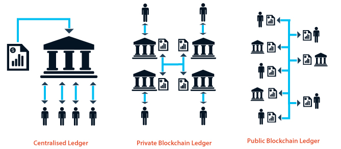

## Wat is Blockchain?

Een onveranderlijk, gedistribueerd grootboek

*An Immutable, Distributed Ledger*

## Wat bedoelen we met een grootboek?

Een database met daarin informatie als saldi, eigendomsbewijzen, smart
contract status.

## Ledgers: een blok

\ 

## Recursion

\ 

## Recursion
* Blok 1 = transacties + reward
* Samenvatting Blok 1 = B1
* Blok 2 = B1 + transacties + reward
* Samenvatting Blok 2 = B2
* Blok 3 = B2 + transacties + reward

## Gedistribueerd?

* Anne stuurt geld naar persoon Bob
* Anne maakt hiervoor een transactie aan en stuurt deze naar haar
    server S
* Server S stuurt het naar andere leden op het netwerk. Die sturen het
    weer door etc.
* Alle leden verifiëren de informatie
* Iedereen valideert de informatie
* Geen activiteit zonder permissie van de leden
* Indien geen bezwaren, wordt de transactie toegepast

## Waarom Gedistribueerd?

* Geen centraal "point of failure"
* Kan wereldwijd opschalen
* Trustless, Uncensorable, Permissionless

## Onveranderlijk? (Immutable)

* Data kan niet aangepast worden nadat het in het grootboek is weggeschreven
* Data is controleerbaar
* Er is consensus nodig om het grootboek bij te werken

## Wat is consensus?

* "Iedereen" komt overeen wat de huidige status is
    + Bijvoorbeeld: wat zijn de saldi van iedereens rekeningen

## Hoe komen we tot consensus?

* Consensus algoritmes
    + Proof of work, Proof of stake

## Andere Soorten Ledgers

\ 
