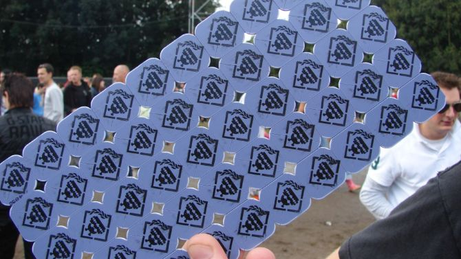
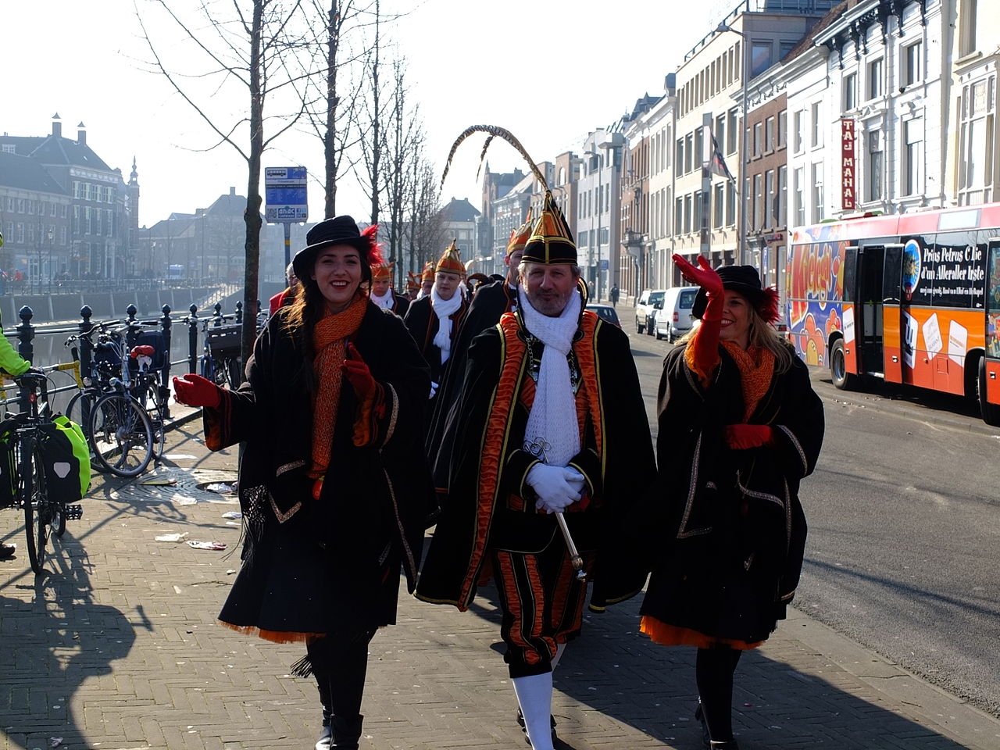

## Do you need a blockchain?

\ 

## Carnaval in Breda

\ 

## Dit is Centraal

\ 

## Do you need a blockchain?

\ 

## Wereldwijde carnavalsmunten?

* Wereldwijd te gebruiken
* Onderling te verhandelen (Eenmalige uitgave gegarandeerd)
* Kleine handelaren (Iedereen kan ontvangen)
* Onafhankelijk, Decentraal, Permissionless

## Do you need a blockchain?

